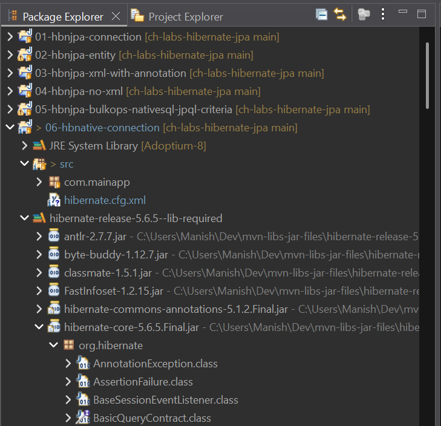
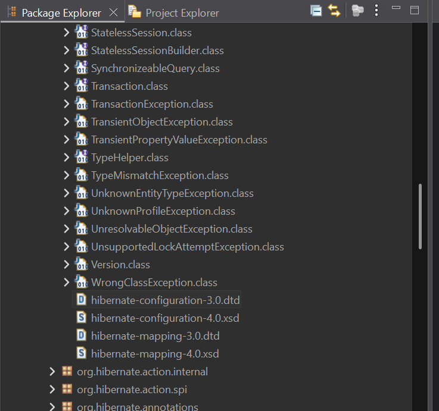
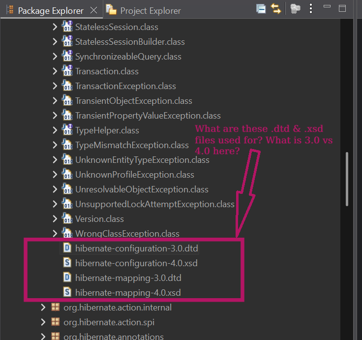

# Hibernate Native API - Establish Connection to Database

Starting from this project, we are not using Hibernate's JPA Implementation
(i.e. not using Hibernate as a JPA Provider), instead we will be using
**Hibernative's Implementation of its own Native API**.

So, we will NOT be using any interfaces, classes, or annotations, etc. from
JPA packages at all.

We will only use interfaces, classes, & annotations, from Hibernate packages
directly.

In this project, we will try establishing connection to our locally running
MySQL RDBMS, using Hibernative Native API.

> [!IMPORTANT]
> This project focuses only on establishing connection to locally running MySQL
> RDBMS server from Hibernate Native API, using:
> - This project only demonstrates the XML approach of establishing connection
>   with `hibernate.cfg.xml` XML Hibernate configuration file.
> - This project does not define any Object/Relational Mapping at all. This
>   project just establishing a DB connection.

## Approaches to specify configuration

As in JPA, two types of configuration have to be specified:

1. Configuration for details about <u>**Connection**</u>.
   
   Similar to JPA, when using Hibernate Native API, we can specify
   **Connection** related configuration using these two (2) approaches:

    - **XML Approach**
       - Uses Hibernate configuration file (conventionally named
       `hibernate.cfg.xml` & placed at classpath).
       - *The scope of this project is ONLY LIMITED to doing this alone.*
    - **Pure Java Approach**
       - *"Hibernate Configuration"* information is supplied in Java code only,
       without creating the `hibernate.cfg.xml` (or similar) XML file.
    <br>

1. Configuration for details about <u>**Object/Relational Mapping(s)**</u>.
   
   Similar to JPA, when using Hibernate Native API, we can specify
   **Object/Relational Mapping(s)** related configuration using these three (3)
   approaches:

    - **XML Approach**
       - Here we specify both the *"Hibernate Configuration"* (i.e. the
       connection related details etc.) & the *"Hibernate Mapping(s)"* (i.e.
       the Object Relational Mappings information) in XML files.
    - **XML + Annotations Approach**
       - In this approach, the *"Hibernate Configuration"* is specified in XML
       file (`hibernate.cfg.xml`); and the *"Hibernate Mapping(s)"* are kept in
       annotations in Java source files.
    - **Pure Java Approach**
       - Here, both the *"Hibernate Configuration"* & the *"Hibernate Mapping(s)"*
       are mentioned in Java source files only.

## XML Approach to specify configuration about Database connection

- In JPA, we specify Connection configuration in `src/META-INF/persistence.xml` file.
- In Native Hibernate, there is no requirement to name the file in any
   way or place it in a particular directory.
- There is however, a convention to name the connection related
   configuration XML file, in Hibernate Native API.
- If we follow this naming convention for the XML file, then we can take
   advantage of the *"convention over configuration" feature* and we won't
   have to specify the XML file's path & name explicitly in Java.
- By convention, we can choose to name the Hibernative Native API's
   Connection configuration file as `hibernate.cfg.xml` & place it inside
   any directory on the classpath, like directly inside `src/` directory.
- Few Hibernate 5.6 Documentation Links about *Hibernate Configuration file*,
   i.e. `hibernate.cfg.xml` and DB connection-related properties:
   - [docs.hibernate.org/orm/5.6/quickstart/html_single/#hibernate-gsg-tutorial-basic-config](https://docs.hibernate.org/orm/5.6/quickstart/html_single/#hibernate-gsg-tutorial-basic-config)
   - [docs.hibernate.org/orm/5.6/userguide/html_single/#configurations-database-connection](https://docs.hibernate.org/orm/5.6/userguide/html_single/#configurations-database-connection)

# Hibernative Native API - XSD & DTD? Configuration File & Mapping File

(**Note:** Section text taken from LLM response. Read with caution.)

In Eclipse project, with User Libary (containing the combined Hibernate JARs)
linked to the project (User Library named
`hibernate-release-5.6.5--lib-required`, as created in other README's). Here if
we expand the following in Eclipse IDE Package Explorer:
- Project
- User Library `hibernate-release-5.6.5--lib-required`
- `hibernate-core-5.6.5.Final.jar` JAR file
- Package `org.hibernate` and scroll down,

then we will find the below four (4) files:
1. `hibernate-configuration-3.0.dtd`
1. `hibernate-configuration-4.0.xsd`
1. `hibernate-mapping-3.0.dtd`
1. `hibernate-mapping-4.0.xsd`

**Note:** Check below screenshots for these 4 files in Package Explorer:

<table align="center" border="1" cellpadding="8">
  <tr>
    <td align="center">
      
      <br />
      <em>Figure 1: Hibernate Configuration & Mapping Files (3.0 & 4.0) - DTD & XSD - Inside JAR</em>
    </td>
  </tr>
  <tr>
    <td align="center">
      
      <br />
      <em>Figure 2: Hibernate Configuration & Mapping Files (3.0 & 4.0) - DTD & XSD - Files</em>
    </td>
  </tr>
  <tr>
    <td align="center">
      
      <br />
      <em>Figure 3: Hibernate Configuration & Mapping Files (3.0 & 4.0) - DTD & XSD - Files Highlighted</em>
    </td>
  </tr>
</table>

<br>

**We discuss about these 2 file types and 2 versions, what they mean for Hibernate Native API, how and which ones to use, below:**

---


## DTD vs XSD — What Those 4 Files Are

First, some vocabulary, about both `.dtd` and `.xsd` file extensions.

Both are ways to define the **grammar rules of an XML file** — i.e., what
elements are allowed, in what order, what attributes they can have, and what is
mandatory vs optional. They are the schema definitions that tools (like
Eclipse) use to give you auto-complete and flag errors when you write XML.

**DTD (Document Type Definition)** is the older format, from the early days of
XML. It has a simpler, limited syntax — it cannot express data types (e.g.
"this attribute must be an integer"), and it uses a completely different syntax
from XML itself.

**XSD (XML Schema Definition)** is the modern replacement. It is itself written
in XML, can express data types, namespaces, and more complex constraints. It is
strictly more powerful than DTD.


## What the 4 Files Inside "hibernate-core" Are

We found these four inside `org/hibernate/` within the JAR:

```
hibernate-configuration-3.0.dtd   ← grammar for hibernate.cfg.xml (old format)

hibernate-configuration-4.0.xsd   ← grammar for hibernate.cfg.xml (new format)

hibernate-mapping-3.0.dtd         ← grammar for *.hbm.xml files (old format)

hibernate-mapping-4.0.xsd         ← grammar for *.hbm.xml files (new format)
```

So there are really only **two distinct grammars** — one for the main
config file, one for entity mapping files — each provided in two
formats (DTD and XSD). The "3.0" and "4.0" here refer to the
**Hibernate XML schema version**, not the Hibernate ORM release version.
Hibernate 5.x still ships and uses both because the underlying XML
structure of these files did not fundamentally change between Hibernate
3 and 5. The grammar version froze.

## Why the XSD Files Have No Example Header in Them

With JPA, the `persistence.xsd` file itself contained a comment showing
you the exact `xmlns`/`xsi:schemaLocation` boilerplate to paste at the
top of `persistence.xml`. Hibernate's XSD files don't do that.

The deeper reason is this: the `xmlns` attribute value in an XML file is
just a logical namespace identifier — it need not be the location where
the XSD is actually published. In Hibernate's case, the XSD is packaged
within the Hibernate JARs and is not published at any live public
URL. So there is no canonical online URL to point `xsi:schemaLocation`
at, which is why Hibernate's own documentation examples never use the
XSD-style header at all.

## What the Community Actually Uses in Practice

Despite the 4.0 XSD files existing inside the JAR, virtually all
real-world Hibernate 5.x examples — including those on DZone and
authoritative tutorial sites — use the DTD-style `<!DOCTYPE>` header,
pointing to the 3.0 DTD. The XSD path never gained traction because
it never worked reliably for `hibernate.cfg.xml` — attempts to use it
with the newer `MetadataSources` API caused parser errors for many
developers, while the DTD path kept working fine across all versions.

So: **use the DTD header**. This is not a compromise or a hack — it is
the universally accepted, Hibernate-team-endorsed approach for Hibernate
5.x.


## What to Write at the Top of Each File

### "hibernate.cfg.xml" (main configuration file)

```xml
<?xml version="1.0" encoding="UTF-8"?>
<!DOCTYPE hibernate-configuration PUBLIC
        "-//Hibernate/Hibernate Configuration DTD 3.0//EN"
        "http://www.hibernate.org/dtd/hibernate-configuration-3.0.dtd">

<hibernate-configuration>
    <session-factory>

        <!-- Database connection -->
        <property name="connection.driver_class">
            com.mysql.cj.jdbc.Driver
        </property>
        <property name="connection.url">
            jdbc:mysql://localhost:3306/your_db_name
        </property>
        <property name="connection.username">root</property>
        <property name="connection.password">yourpassword</property>

        <!-- SQL dialect — tells Hibernate which DB flavour to use -->
        <property name="dialect">
            org.hibernate.dialect.MySQL8Dialect
        </property>

        <!-- Print generated SQL to console — useful while learning -->
        <property name="show_sql">true</property>
        <property name="format_sql">true</property>

        <!-- Register your entity mapping files here -->
        <!-- <mapping resource="com/mainapp/Student.hbm.xml"/> -->

    </session-factory>
</hibernate-configuration>
```

### "ClassName.hbm.xml" (entity mapping file, one per mapped class)

```xml
<?xml version="1.0" encoding="UTF-8"?>
<!DOCTYPE hibernate-mapping PUBLIC
        "-//Hibernate/Hibernate Mapping DTD 3.0//EN"
        "http://www.hibernate.org/dtd/hibernate-mapping-3.0.dtd">

<hibernate-mapping>
    <class name="com.mainapp.Student" table="STUDENT">

        <id name="id" column="id">
            <generator class="native"/>
        </id>

        <property name="firstName" column="first_name"/>
        <property name="lastName"  column="last_name"/>

    </class>
</hibernate-mapping>
```

## One Thing Worth Noting About the DTD URL

The URL in the `<!DOCTYPE>` line —
`http://www.hibernate.org/dtd/hibernate-configuration-3.0.dtd` — looks
like a network address, but **Hibernate does not actually fetch it from
the internet at runtime**. Hibernate intercepts that URL internally and
resolves it against the DTD files bundled inside `hibernate-core.jar`
(the very files we saw in the screenshots). So it works completely
offline. The URL is just a logical identifier, same as namespaces in XSD.
