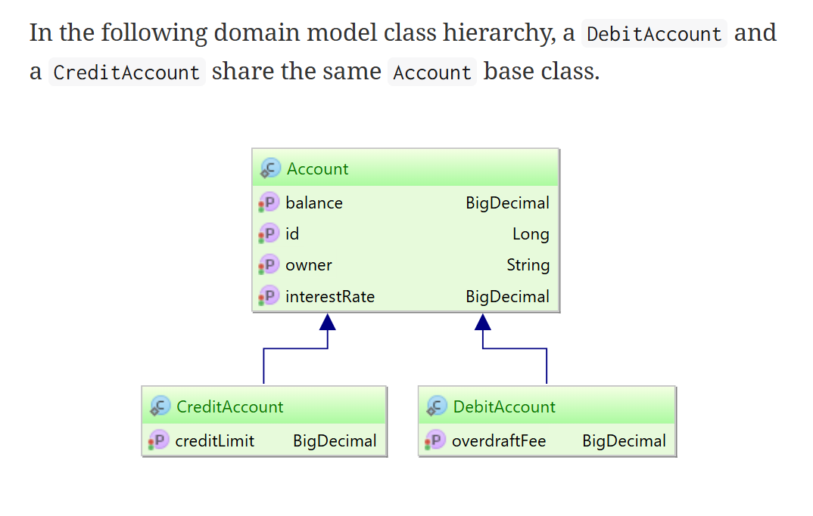

# Hibernate (Entity) Inheritance & Polymorphic Queries

All these features are supported by both Hibernate (Native API) and also by JPA.

This is documented well (with good examples) in Hibernate Userguide's section
on Inheritance:

[docs.hibernate.org/orm/5.6/userguide/html_single/#entity-inheritance](https://docs.hibernate.org/orm/5.6/userguide/html_single/#entity-inheritance)

## Inheritance Strategies

Taken from the above documentation link:

Although relational database systems don’t provide support for inheritance,
Hibernate provides several strategies to leverage this object-oriented trait
onto domain model entities:

1. **MappedSuperclass :**
  Inheritance is implemented in the domain model only without reflecting it in
  the database schema.

1. **Single table :**
  The domain model class hierarchy is materialized into a single table which
  contains entities belonging to different class types.

1. **Joined table :**
  The base class and all the subclasses have their own database tables and
  fetching a subclass entity requires a join with the parent table as well.

1. **Table per class :**
  Each subclass has its own table containing both the subclass and the base
  class properties.

<table align="center" border="1" cellpadding="8">
  <tr>
    <td align="center">
      
       
      <em>Figure 1: Hibernate Inheritance Strategies</em>
    </td>
  </tr>
</table>
