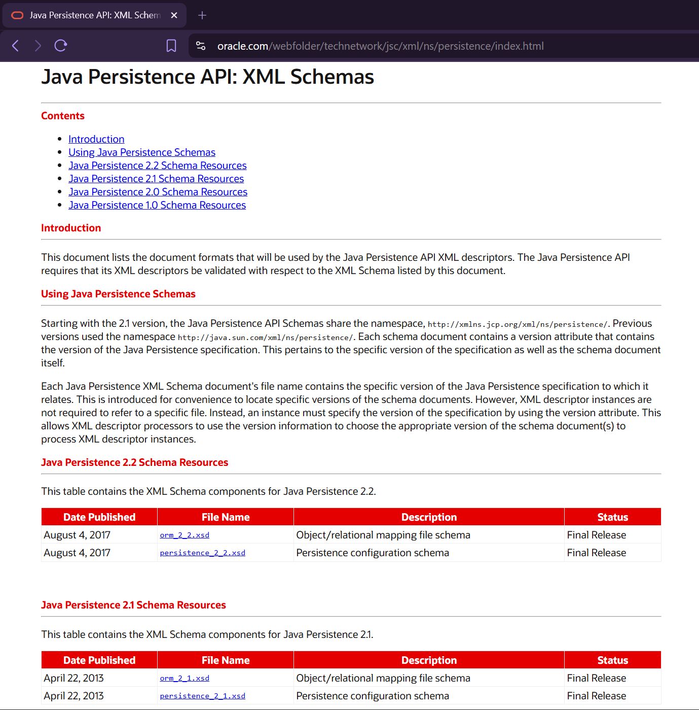

# Explanation about XML Metadata attributes for Schema / Namespace Declaration

We have seen different XML files used in different scenarios, that declare some
metadata at the start of the file, which is the namespace and schema etc. detail
that helps IDEs validate the XML file for the purpose it is intended to be used
& also provide auto-complete suggestion while authoring the file, that prevents
typos. This schema / namespace metadata may or may not be also used by framework
(e.g. Hibernate, Tomcat Servlet Container, etc.) to validate and / or parse the
XML properly.

We have worked with below different XML files:

- **web.xml** (`src/main/webapp/WEB-INF/web.xml`) -- Used in Servlet / JSP based
  Eclipse's Dynamic Web Projects. Also called as the *Deployment Descriptor*.<br>
  Sample `web.xml` metadata declaration:
  ```xml
  <?xml version="1.0" encoding="UTF-8"?>
  <!DOCTYPE web-app PUBLIC
    "-//Sun Microsystems, Inc.//DTD Web Application 2.3//EN"
    "http://java.sun.com/dtd/web-app_2_3.dtd">

  <web-app id="WebApp_ID">
    ...
  </web-app>
  ```
- **persistence.xml** (`src/META-INF/persistence.xml`) -- Used in JPA projects,
  for providing RDBMS connection related configuration to the JPA Provider
  Framework (like Hibernate, Eclipse Link, OpenJPA, etc.). Also called as the
  *Persistence Descriptor*.<br>
  Sample `persistence.xml` metadata declaration:
  ```xml
  <?xml version="1.0" encoding="UTF-8"?>
  <persistence xmlns="http://xmlns.jcp.org/xml/ns/persistence"
      xmlns:xsi="http://www.w3.org/2001/XMLSchema-instance"
      xsi:schemaLocation="http://xmlns.jcp.org/xml/ns/persistence
          http://xmlns.jcp.org/xml/ns/persistence/persistence_2_2.xsd"
      version="2.2">

      ...

  </persistence>
  ```
- **orm.xml** (`src/META-INF/orm.xml`) -- Used in JPA projects again, as the
  *Object/Relational Mapping File*.<br>
  Sample `orm.xml` metadata declaration:
  ```xml
  <?xml version="1.0" encoding="UTF-8"?>
  <entity-mappings xmlns="http://xmlns.jcp.org/xml/ns/persistence/orm"
      xmlns:xsi="http://www.w3.org/2001/XMLSchema-instance"
      xsi:schemaLocation="http://xmlns.jcp.org/xml/ns/persistence/orm
          http://xmlns.jcp.org/xml/ns/persistence/orm_2_2.xsd"
      version="2.2">

          ...

  </entity-mappings>
  ```

# XML Schema / Namespace Explanation for "persistence.xml" File

## What is an XSD File?

An **XSD file** (XML Schema Definition) is essentially a blueprint that defines
the structure, elements, and data types allowed in an XML document.

In the context of **JPA**'s `persistence.xml`, the `xsi:schemaLocation`
attribute points to the official XML Schema files published by the JPA
specification.

### Why is XSD File used in "persistence.xml"?

- **Validation:** Ensures your persistence.xml follows the correct structure
  (e.g., `<persistence-unit>`, `<properties>`, etc.).
- **IDE Support:** Tools like Eclipse or IntelliJ use the schema to provide
  auto-completion, validation, and error highlighting.
- **Portability:** Confirms your configuration matches the JPA standard, so it
  works across different providers (Hibernate, EclipseLink, etc.).

In a typical persistence.xml you'll see something like:

```xml
<persistence xmlns="http://xmlns.jcp.org/xml/ns/persistence"
             xmlns:xsi="http://www.w3.org/2001/XMLSchema-instance"
             xsi:schemaLocation="http://xmlns.jcp.org/xml/ns/persistence
                                 http://xmlns.jcp.org/xml/ns/persistence/persistence_2_2.xsd"
             version="2.2">
    <persistence-unit name="myPU">
        <properties>
            <property name="javax.persistence.jdbc.url" value="jdbc:h2:mem:test" />
        </properties>
    </persistence-unit>
</persistence>

```

Here:

- The **namespace** ([http://xmlns.jcp.org/xml/ns/persistence](http://xmlns.jcp.org/xml/ns/persistence))
  identifies the XML vocabulary.
- The **schemaLocation** maps that namespace to the actual `.xsd` file (e.g., `persistence_2_2.xsd`).
- The **`.xsd` file** itself defines what tags and attributes are valid inside `persistence.xml`.

> [!NOTE]
> In fact, the above namespace URL [http://xmlns.jcp.org/xml/ns/persistence](http://xmlns.jcp.org/xml/ns/persistence)
> actually redirects to [www.oracle.com/webfolder/technetwork/jsc/xml/ns/persistence/index.html](https://www.oracle.com/webfolder/technetwork/jsc/xml/ns/persistence/index.html)
> where the XSD Files for both "persistence.xml" and "orm.xml" are hosted for
> JPA Specification versions 2.2, 2.1, 2.0, and 1.0.

A screenshot of above mentioned website
[www.oracle.com/webfolder/technetwork/jsc/xml/ns/persistence/index.html](https://www.oracle.com/webfolder/technetwork/jsc/xml/ns/persistence/index.html), is attached below:

<table align="center" border="1" cellpadding="8">
  <tr>
    <td align="center">
      
      <br />
      <em>Figure 1: JPA XML Namespace Webpage which hosts XSD Files</em>
    </td>
  </tr>
</table>
<br>

## Attribute meanings in persistence.xml

- `xmlns="http://xmlns.jcp.org/xml/ns/persistence"`
  - Declares the **default XML namespace**.
  - It tells the parser: *all elements without a prefix (like `<persistence-unit>`) belong to the JPA persistence schema defined at this URI*.
  - This avoids conflicts if multiple XML vocabularies are used in the same file.

- `xmlns:xsi="http://www.w3.org/2001/XMLSchema-instance"`
  - Declares the **XML Schema Instance namespace**.
  - This namespace provides attributes like `xsi:schemaLocation` and `xsi:type`.
  - Without this, you cannot use `xsi:schemaLocation` to link your XML to its schema.

- `xsi:schemaLocation="http://xmlns.jcp.org/xml/ns/persistence http://xmlns.jcp.org/xml/ns/persistence/persistence_2_2.xsd"`
  - **Associates** a *namespace* **with** the actual `XSD file` that defines
     its structure.
  - The first part (`http://xmlns.jcp.org/xml/ns/persistence`) is the namespace URI.
  - The second part (`http://xmlns.jcp.org/xml/ns/persistence/persistence_2_2.xsd`)
     is the physical location of the schema file.
  - This lets XML validators and IDEs check that your document follows the
     rules defined in the schema (e.g., which elements are allowed inside
     `<persistence>`).

- `version="2.2"`
  - Specifies the **JPA specification version** that this *Persistence Descriptor*
     conforms to.
  - Ensures compatibility with the features and structure defined in JPA 2.2.
  - Different versions (e.g., 2.0, 2.1, 2.2, 3.0) may allow different elements
     or attributes.

<br>

Summarizing, in persistence.xml:

- `xmlns`: declares the default namespace so the parser knows which schema
  rules apply.
- `xmlns:xsi`: enables schema-related attributes.
- `xsi:schemaLocation`: maps the namespace to the actual XSD file that defines
  the allowed structure. And,
- `version`: specifies which JPA specification version the file conforms to.

Together, these attributes ensure the XML is valid, portable, and understood by
tools and JPA providers.
