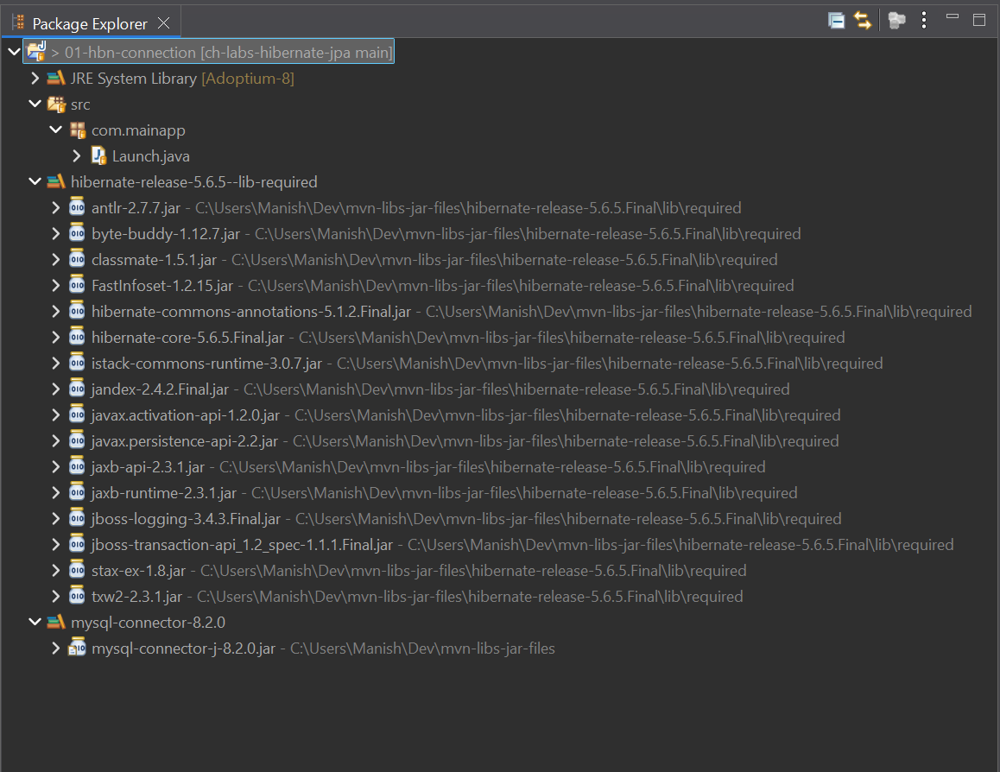
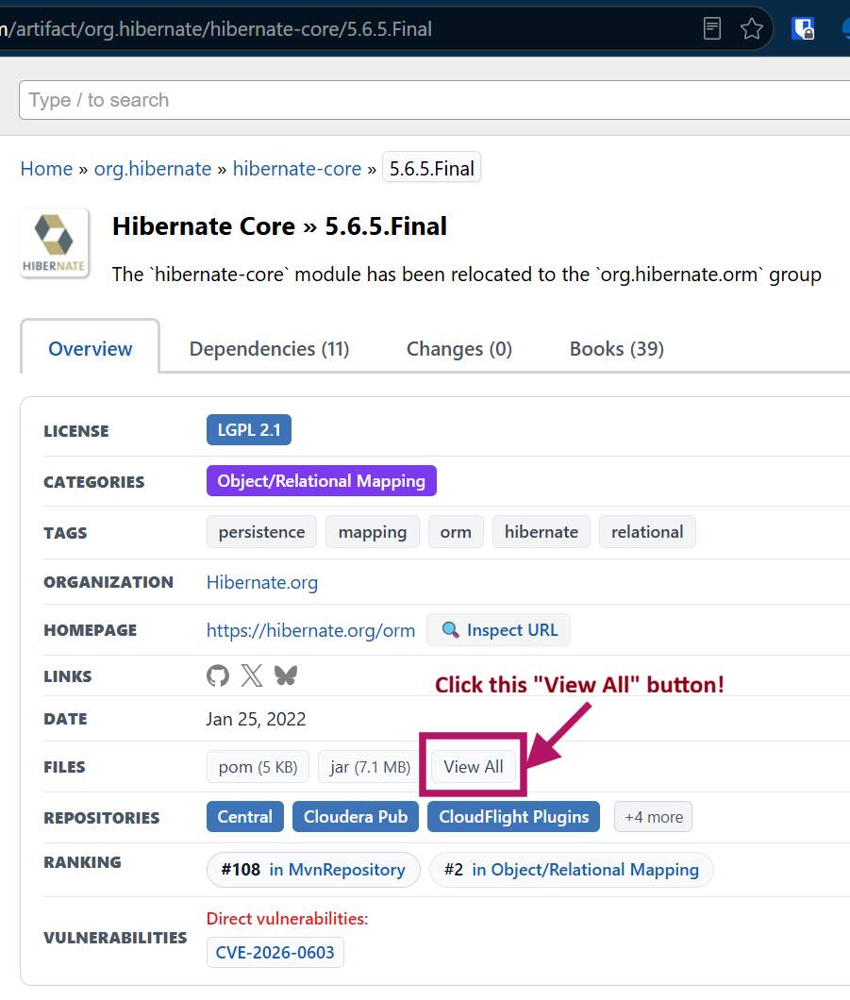
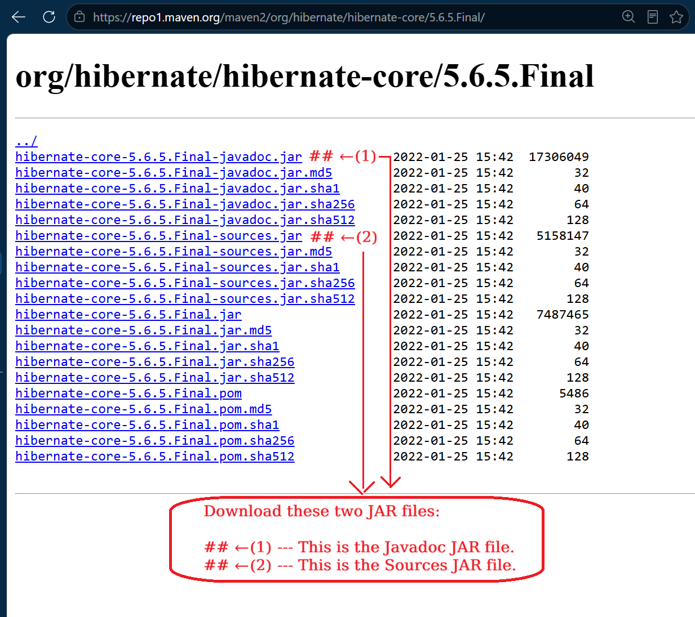

# Setup for Hibernate and JPA

JPA (Java Persistence API) is part of JavaEE (Java Enterprise Edition), and not
part of JavaSE (Java Standard Edition).

Therefore, JPA is not a part of the JRE System Library (JSL). Similar to how the
Servlet / JSP related interfaces from the Servlet API were not part of JRE
System Library (JSL), and we had to get them from external sources (which, in
fact, happened to be Apache Tomcat server).

> [!NOTE]
> In the case of JDBC API, we didn't have to get the API interfaces in `java.sql`
> package (like Connection, Statement, ResultSet, etc. interfaces) from any JAR
> or other external sources. The interfaces/classes of JDBC API are all part of
> JRE System Library (JSL) itself.
>
> We only needed to get the JAR for the Database Driver (like MySQL Connector J)
> externally. That is, the implementation of the JDBC specification, which is
> the JDBC Driver had to be taken externally. And the JDBC API itself and all
> the interfaces present in the JDBC API (`java.sql` and `javax.sql`) - these
> all are part of JRE System Library (JSL) and are readily available for usage
> without any external JAR(s).

Hibernate, being a third-party framework, which is outside the Java language,
i.e. outside JavaSE & JavaEE, which is developed by the Hibernate Community,
which is primarily led by Red Hat. Therefore, we definitely would require an
external JAR for Hibernate.

Hibernate is a collection of JARs working together.

These can be found at:

1. On mvnrepository.com page for [org.hibernate group-id](https://mvnrepository.com/artifact/org.hibernate).
1. On sourceforge.net where fully bundled releases are maintained for each
   versions. This is hosted at [sourceforge.net/projects/hibernate/](https://sourceforge.net/projects/hibernate/).

JPA is an API / Specification, i.e. mostly a set of interfaces; and one of the
modules of JavaEE Specification.

So, how to get JPA's interfaces in our project?

JavaEE Specification is implemented to different extents by various **Java
Application Servers**. Some Application Servers choose to implement a fair
number of JavaEE modules, while some implement only a selected very few JavaEE
modules, and some choose to implement the entire JavaEE specifications.

For working with Servlets & JSP, we picked Apache Tomcat v9.0.x as our choice of
Java Application Server. Tomcat implements only the Servlet/JSP modules of the
JavaEE Specification. Tomcat provides us the Servlet API interfaces, and also
their implementation code. So, Apache Tomcat, is a very light-weight Application
Server, which only implements the Servlet API, and not other parts of JavaEE.

Hence, Tomcat does not contain, *neither* the JPA API (i.e. the interfaces /
abstract classes / annotations for the JPA Specification), *nor* the
implementation of JPA API (for which we anyways are already going to use the
third-party Hibernate Framework).

Therefore, we will not rely on other Application Servers (like the
*Full JavaEE Servers* such as WildFly, TomEE, GlassFish, Payara, etc.), just
for getting the JPA API interfaces (since Tomcat is not providing them, and we
don't wish to use another Application Server for only working with JPA &
Hibernate).

Instead, we can just use an external JAR to get access to the JPA API
interfaces. We will use JPA API Version 2.2 from mvnrepository.com here:
[javax.persistence/javax.persistence-api/2.2](https://mvnrepository.com/artifact/javax.persistence/javax.persistence-api/2.2).

[sourceforge.net/projects/hibernate/files/hibernate-orm/5.6.5.Final/hibernate-release-5.6.5.Final.zip/download](https://sourceforge.net/projects/hibernate/files/hibernate-orm/5.6.5.Final/hibernate-release-5.6.5.Final.zip/download)


---

<br>

## Setting Up Hibernate + JPA Without Maven / Gradle


### The JPA API JAR (`javax.persistence-api-2.2.jar`)

The JPA 2.2 spec ships as a single, small (~160 KB) JAR containing only
interfaces, annotations, and abstract classes — `@Entity`, `@Id`,
`@Column`, `EntityManager`, `EntityManagerFactory`, and so on. It has
zero runtime behaviour on its own; it exists purely so your code
compiles against the standard JPA API.

**This JAR does not need to be downloaded separately** when setting up
Hibernate manually, because Hibernate's release ZIP already bundles it.
See the section below.

---

### The Hibernate Release ZIP — The Authoritative Manual Install

The Hibernate project publishes an official release ZIP on SourceForge
for each version. We will use Version 5.6.5.Final and its files (bundled as a
ZIP archive containing all JARs) on SourceForge are present here:
[sourceforge.net/projects/hibernate/files/hibernate-orm/5.6.5.Final/](https://sourceforge.net/projects/hibernate/files/hibernate-orm/5.6.5.Final/)

Or the direct ZIP download link on this page is this:
[sourceforge.net/projects/hibernate/files/hibernate-orm/5.6.5.Final/hibernate-release-5.6.5.Final.zip/download](https://sourceforge.net/projects/hibernate/files/hibernate-orm/5.6.5.Final/hibernate-release-5.6.5.Final.zip/download)

This ZIP is the canonical distribution for non-Maven setups. It bundles
`hibernate-core` together with every mandatory dependency, pre-resolved
and ready to add to a build path. The internal structure is:

```
hibernate-release-5.6.5.Final/
├── lib/
│   ├── required/      ← all mandatory JARs; add every file here
│   └── optional/      ← feature-specific extras; ignore for basics
├── documentation/
└── ...
```

The `lib/required/` folder contains approximately:

| JAR                                   | Purpose                               |
|---------------------------------------|---------------------------------------|
| `hibernate-core-5.6.5.Final.jar`      | The ORM engine; JPA impl + native API |
| `javax.persistence-api-2.2.jar`       | JPA 2.2 interfaces and annotations    |
| `jboss-logging-3.x.x.Final.jar`       | Logging facade used internally        |
| `byte-buddy-1.x.x.jar`                | Runtime proxy/bytecode generation     |
| `antlr-2.7.x.jar`                     | HQL query language parser             |
| `jandex-2.x.x.Final.jar`              | Annotation indexing                   |
| `classmate-1.x.x.jar`                 | Generic type resolution               |
| `hibernate-commons-annotations-*.jar` | Shared annotation utilities           |

All of these are required. Hibernate will not initialise if any is
missing from the classpath.

---

### The `org.hibernate` Group on mvnrepository — What to Ignore

The `org.hibernate` group on Maven Central lists many artifacts. Most
are optional extensions unrelated to core ORM functionality:

| Artifact              | What it is                                    | Needed?    |
|-----------------------|-----------------------------------------------|------------|
| `hibernate-core`      | ORM engine — JPA impl + native API            | ✅ Always |
| `hibernate-validator` | Bean Validation (JSR-380); a separate project | ℹ️ No     |
| `hibernate-hikaricp`  | HikariCP connection pool integration          | ℹ️ No     |
| `hibernate-c3p0`      | c3p0 connection pool integration              | ℹ️ No     |
| `hibernate-ehcache`   | Ehcache second-level cache integration        | ℹ️ No     |
| `hibernate-envers`    | Entity audit logging                          | ℹ️ No     |
| `hibernate-tools`     | IDE / schema reverse-engineering tooling      | ℹ️ No     |
| `hibernate-spatial`   | Geospatial data type support                  | ℹ️ No     |

For learning Hibernate ORM — both the JPA-style API and the native
`Session`/`SessionFactory` API — `hibernate-core` is the only Hibernate
artifact required. Everything else addresses specific advanced use cases.

The `lib/optional/` folder in the release ZIP mirrors these extras:
sub-folders for c3p0, Ehcache, etc. They can be ignored entirely during
a standard learning setup.

---

### Eclipse Build Path Setup

#### JARs required in total:

1. All JARs from `lib/required/` in the Hibernate release ZIP
2. The MySQL JDBC driver: `mysql-connector-java-x.x.x.jar`
   (download from https://dev.mysql.com/downloads/connector/j/)
   - We will get it from
     [com.mysql/mysql-connector-j/8.2.0](https://mvnrepository.com/artifact/com.mysql/mysql-connector-j/8.2.0)
     link on mvnrepository.com.

#### Steps in Eclipse:

1. Right-click the project →
   **Build Path** → **Configure Build Path**
2. **Libraries** tab → **Add External JARs…**
3. Select every JAR inside `lib/required/`
4. Repeat for the MySQL connector JAR
5. **Apply and Close**

This adds all JARs, i.e. in Hibernate zip bundle (inside its `lib/required/`
path) and also the MySQL Connector J's JAR all under one level, which will show
up under the **Referenced Libraries** section along-side other prominents items
in Package / Project Explorer in Eclipse like *JRE System Library [Adoptium-8]*
and *src/* Folder.

> [!TIP]
> Instead of directly putting all the JARs under Referenced Libraries by just
> using the "Add External JARs..." button in the project properties window
> option **Java Build Path** > **Libraries tab**.
> Instead, we can create two separate **User Library**'s, first that contains
> all JARs relevant to Hibernate & JPA, and second that contains the MySQL
> Connector J's JAR.
> These User Libraries in Eclipse can be used throughout projects in an Eclipse
> Workspace. For new workspaces, these might need to be created again.
> We will provide below custom names for these two User Libraries:
> 1. `hibernate-release-5.6.5--lib-required` for the User Library containing
>    all the Hibernate essential JARs.
> 1. `mysql-connector-8.2.0` for the User Library containing the JAR for MySQL
>    Connector J

#### Add JARs in separate User Libraries in Eclipse:

- Right-click the project, and select Properties from the context menu.
- From the Project Properties popup, select Java Build Path menu option from
the left side-bar.
- Then select the "Libraries" tab from the main section. This Libraries tab
represents the classpath.
- Now, the right-hand side has some buttons - select the "Add Library" button.
- This opens the "Add Library" popup. Select "User Library" from the list and
click Next.
- Now we see a list of previously created "User Libraries" - which can be empty
if we have not yet added any, or if it's a new Eclipse Workspace.
- If we have not previously created the two User Libraries that we discussed
about, then we will do that now.
- Click the "User Libraries..." button on the right-hand side.
- A new popup opens up. Here click the "New..." button from the right-hand side.
- Which opens a tiny dialog box "New User Library" - where we need to enter a
name for our library. Enter any name (the ones we discussed) and click "OK"
button. As discussed we will two User Libraries with these names & click "OK":
  1. `hibernate-release-5.6.5--lib-required`
  1. `mysql-connector-8.2.0`
- This creates a new entry with this name in the previous popup's list of
**"Defined user libraries:"** with the name(s) we provided in previous step.
- We should have entries for the two User Libraries items in this window.
- Select the newly created User Library item, one-by-one. (First perform the
further steps for the `hibernate-release-5.6.5--lib-required` User Library, and
then for the `mysql-connector-8.2.0` User Library.)
- And click on the "Add External JARs..." button from the right-hand side.
- Select the downloaded JAR from the file-picker.
  1. For `hibernate-release-5.6.5--lib-required` User Library: From the ZIP
     file download from SourceForge, select all the JAR files present in the path `hibernate-release-5.6.5.Final/lib/required`.
  1. For `mysql-connector-8.2.0` User Library: Select the JAR file
     `mysql-connector-j-8.2.0.jar` downloaded from
     [com.mysql/mysql-connector-j/8.2.0](https://mvnrepository.com/artifact/com.mysql/mysql-connector-j/8.2.0) location.
- Then click "Apply and Close" button at the bottom of the popup.
- Click "Finish" button from the previous popup.
- Finally, click the "Apply and Close" button from the original project
properties "Java Build Path" popup.

> [!IMPORTANT]
> Eclipse will resolve all JPA and Hibernate imports after this. No other
> JARs are needed for the duration of a Hibernate + JPA learning project.

#### Package Explorer after adding all JARs

Below is screenshot of Eclipse Package Explorer of a project, after creating
the two User Libraries, adding the respective JARs to them, and hooking the
Libraries up with the new Java Project.

<table align="center" border="1" cellpadding="8">
  <tr>
    <td align="center">
      
      <br />
      <em>Figure 1: Hibernate/JPA/MySQL JARs Added to Eclipse Java Project</em>
    </td>
  </tr>
</table>

#### Download & link Sources JARs & Javadoc JARs for few of above JARs

Download `*-sources.jar` and `*-javadoc.jar` files from the below mentioned
mvnrepository.com links for few of the libraries (i.e. for the few classes / 
interfaces / annotations / etc. sources codes) that we might need to inspect in
Eclipse IDE using Ctrl + Click and jump to their Source Code.

Go to the mentioned mvnrepository.com links, and on that page, in the **Overview**
tab, you will find a line item **Files** with few buttons thay say `pom (5 KB)`,
`jar (7.1 MB)`, `View All`, etc.

Click on the **View All** button, as depicted in below screenshot:

<table align="center" border="1" cellpadding="8">
  <tr>
    <td align="center">
      
      <br />
      <em>Figure 2: MVN Repository - Artifact Overview Tab</em>
    </td>
  </tr>
</table>
<br>

Clicking on the **View All** button will open a page listing all JAR files for
this artifact. This page's URL will be something of the format:
[repo1.maven.org/maven2/org/hibernate/hibernate-core/5.6.5.Final/](https://repo1.maven.org/maven2/org/hibernate/hibernate-core/5.6.5.Final/)
depending on the artifact.

From this page, we will download two JAR files, as highlighted in below
screenshot:

1. `[artifact]-javadoc.jar`: This is the Javadoc JAR file for the artifact.
   Example file name `hibernate-core-5.6.5.Final-javadoc.jar`, or
   `mysql-connector-j-8.2.0-javadoc.jar`, or `javax.persistence-api-2.2-javadoc.jar`
   etc. depending on the artifact we're currently downloading for.
1. `[artifact]-sources.jar`: This is the Sources JAR file for the artifact.
   Example file name `hibernate-core-5.6.5.Final-sources.jar`, or
   `mysql-connector-j-8.2.0-sources.jar`, or `javax.persistence-api-2.2-sources.jar`
   etc. depending on the artifact we're currently downloading for.

<table align="center" border="1" cellpadding="8">
  <tr>
    <td align="center">
      
      <br />
      <em>Figure 3: MVN Repository - Artifact View All Files Page</em>
    </td>
  </tr>
</table>
<br>

**Download Sources & Javadoc JARs for these Libraries from below mentioned MVN Repository Links:**

> Note: What is a **Binary JAR**?
> In Maven terminology, JAR files that only contain compiled `.class` files and
> project resources (without source code or Javadoc) are most commonly referred
> to as the **binary JAR** or simply the **main artifact**.
> It can also be described as: The standard distribution file containing
> compiled bytecode ready for execution by the JVM.

1. [com.mysql/mysql-connector-j/8.2.0](https://mvnrepository.com/artifact/com.mysql/mysql-connector-j/8.2.0)
   - This is for the Binary JAR `mysql-connector-j-8.2.0.jar`.
1. [javax.persistence/javax.persistence-api/2.2](https://mvnrepository.com/artifact/javax.persistence/javax.persistence-api/2.2)
   - This is for the Binary JAR `javax.persistence-api-2.2.jar`.
1. [org.hibernate/hibernate-core/5.6.5.Final](https://mvnrepository.com/artifact/org.hibernate/hibernate-core/5.6.5.Final)
   - This is for the Binary JAR `hibernate-core-5.6.5.Final.jar`.
1. [org.hibernate.common/hibernate-commons-annotations/5.1.2.Final](https://mvnrepository.com/artifact/org.hibernate.common/hibernate-commons-annotations/5.1.2.Final)
   - (Note: this artifact only has the `-sources.jar` file, and not the javadoc file.)
   - This is for the Binary JAR `hibernate-commons-annotations-5.1.2.Final.jar`.

**Link the Source & Javadoc JARs with the respective Library JARs in Eclipse:**

Expand your Java Project's node in the Package Explorer of Eclipse IDE. Then,
also expand the two User Libraries (viz. `hibernate-release-5.6.5--lib-required`
and `mysql-connector-8.2.0`, which we created in earlier sections, and linked
to this project) under this project in Package Explorer.

After expanding the Project, and within it, the User Libraries, we will see the
list of Binary JARs present in each User Library. The view will look like
*Figure 1: Hibernate/JPA/MySQL JARs Added to Eclipse Java Project* which is
attached in [an earlier section](#package-explorer-after-adding-all-jars) on
this same Markdown page.

Now, one-by-one, for each of the Binary JARs (for which we downloaded the 
Sources & Javadoc JAR):
- Right-click that Binary JAR in the Package Explorer,
and select **Properties** option from the context-menu.
- In the left sidebar of the Properties popup, select these options one-by-one:
  - **Javadoc Location** option
  - **Java Source Attachment** option
- For above options, follow the steps mentioned in the section titled:
  [Link the sources JAR for these JARs](https://github.com/manishbhatt94/ch-labs-servlet-jsp/tree/main/12-jstl-sql#link-the-sources-jar-for-these-jars)
  on the README page of another GitHub repository of mine.

---
<br>

## Peristence Schema to use in &nbsp;`src/META-INF/persistence.xml`&nbsp; configuration file

The XML schema / namespace information for JPA 2.2 (which we're using) is
mentioned in website:
[Java Persistence API: XML Schemas](https://www.oracle.com/webfolder/technetwork/jsc/xml/ns/persistence/index.html#2.2)
inside file `persistence_2_2.xsd` which can be downloaded from this website's
section titled **"Java Persistence 2.2 Schema Resources"**.

In this file, we can note the below mentioned documentation within the
`<xsd:annotation> -> <xsd:documentation>` XML elements:

```xml
<?xml version="1.0" encoding="UTF-8"?>
<!-- persistence.xml schema -->
<xsd:schema targetNamespace="http://xmlns.jcp.org/xml/ns/persistence"
	xmlns:xsd="http://www.w3.org/2001/XMLSchema"
	xmlns:persistence="http://xmlns.jcp.org/xml/ns/persistence"
  elementFormDefault="qualified" 
  attributeFormDefault="unqualified" 
  version="2.2">
	<xsd:annotation>
		<xsd:documentation>
      @(#)persistence_2_2.xsd 2.2  July 17, 2017
    </xsd:documentation>
	</xsd:annotation>
	<xsd:annotation>
		<xsd:documentation>

  Copyright (c) 2008  - 2017 Oracle Corporation. All rights reserved. 
  
  This program and the accompanying materials are made available under the 
  terms of the Eclipse Public License v1.0 and Eclipse Distribution License v. 1.0 
  which accompanies this distribution. 
  The Eclipse Public License is available at http://www.eclipse.org/legal/epl-v10.html
  and the Eclipse Distribution License is available at 
  http://www.eclipse.org/org/documents/edl-v10.php.
  
  Contributors:
      Linda DeMichiel - Java Persistence 2.2, Version 2.2 (July 7, 2017)
      Specification available from http://jcp.org/en/jsr/detail?id=338
 
    </xsd:documentation>
	</xsd:annotation>
	<xsd:annotation>
		<xsd:documentation>
			<![CDATA[

     This is the XML Schema for the persistence configuration file.
     The file must be named "META-INF/persistence.xml" in the 
     persistence archive.

     Persistence configuration files must indicate
     the persistence schema by using the persistence namespace:

     http://xmlns.jcp.org/xml/ns/persistence

     and indicate the version of the schema by
     using the version element as shown below:

      <persistence
			xmlns="http://xmlns.jcp.org/xml/ns/persistence"
			xmlns:xsi="http://www.w3.org/2001/XMLSchema-instance"
            xsi:schemaLocation="http://xmlns.jcp.org/xml/ns/persistence
                    http://xmlns.jcp.org/xml/ns/persistence/persistence_2_2.xsd"
            version="2.2">

          ...

      </persistence>

    ]]>
		</xsd:documentation>
	</xsd:annotation>

  ...
</xsd:schema>
```

From above, we need to copy the definition of `<persistence>` XML element.

### How our "persistence.xml" file should look:

Here is the starting point of reference of a sample `persistence.xml` file,
with the `<persistence>` tag properly mentioned with XML Scheme Namespaces etc.

```xml
<?xml version="1.0" encoding="UTF-8"?>
<persistence xmlns="http://xmlns.jcp.org/xml/ns/persistence"
	xmlns:xsi="http://www.w3.org/2001/XMLSchema-instance"
	xsi:schemaLocation="http://xmlns.jcp.org/xml/ns/persistence
             http://xmlns.jcp.org/xml/ns/persistence/persistence_2_2.xsd"
	version="2.2">

	<persistence-unit name="my-persistence-unit-1"></persistence-unit>

</persistence>
```

> [!NOTE]
> A sample `persistence.xml` file (with a minor difference that it references
> JPA Version 2.0), is provided in
> [Hibernate 5.6 Getting Started Guide](https://docs.hibernate.org/orm/5.6/quickstart/html_single/#hibernate-gsg-tutorial-jpa-config)'s section titled
> *4.1 Tutorial Using the Java Persistence API (JPA) -> persistence.xml*. Make
> sure to also check this out.

Inside the `<persistence>` tag, we define one or more `<persistence-unit>` tags
with a `name` attribute, whose value we need to reference in our Java code:

```java
EntityManagerFactory emf = Persistence.createEntityManagerFactory("my-persistence-unit-1");
```
