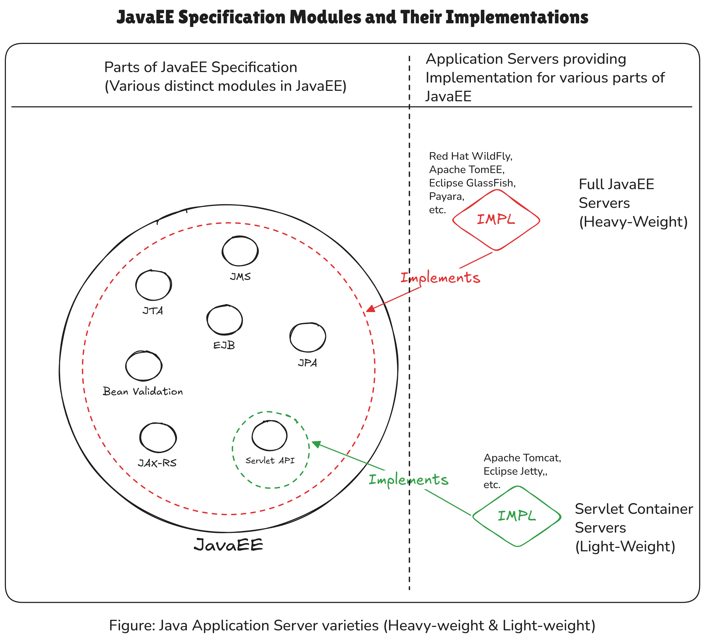

# CH Labs -- Hibernate Framework

Eclipse IDE Workspace - with multiple Java projects to get comfortable with Java
RDBMS ORM-based persistence framework **HIBERNATE**.

Hibernate consists of two separate implementations of specifications:

1. **JPA Specification**: Hibernate provides implementation for the JPA (Java /
   Jakarta Persistence API) Specification.
1. **Hibernate Native API Specification**: Hibernate provides its own *native*
   specification (called as Hibernate's Native API) which is a super-set of JPA,
   and has additional features to what JPA specifies. Hibernate also provides
   the implementation of its Native API, in additional to JPA implementation.

Above two implementations are two separate ways of using Hibernate. We explore
both these ways in this Eclipse Workspace.

## When to use Hibernate's JPA Implementation vs Hibernate's Native API Implementation?

JPA Specification is implemented by multiple other frameworks apart from
Hibernate, for instance **Eclipse Link** also implements JPA Specification.

So, if we want to make sure our code-base is able to switch to an entirely
different JPA implementation framework away from Hibernate, then we must use
Hibernate's JPA Implementation, and write our code accordingly, using the
interfaces provided by JPA.

But, if we are sure that we won't be switching Frameworks, and will stick with
Hibernate Framework only; and we do want to leverage the additional features
that Hibernate's Native API provides on top of JPA, then we can consider using
Hibernate's Native API Implementation.

## JavaEE Specification Modules and Their Implementations

Refer to the write-up in [JAVA_ECOSYSTEM_README.md](./JAVA_ECOSYSTEM_README.md),
and also to the below diagram to get a rough understanding of JavaEE specs and
their implementations contained in Application Servers.

<table align="center" border="1" cellpadding="8">
  <tr>
    <td align="center">
      
      <br />
      <em>Figure 1: JavaEE Specification Modules and Their Implementations</em>
    </td>
  </tr>
</table>

## Setup Instructions

### Hibernate & JPA Setup

For setting up Hibernate & JPA for the projects in this repository, refer to
documentation in [HBN_JPA_SETUP.md](./HBN_JPA_SETUP.md) file.

## Java 8 (Adoptium Temurin 8) Setup in Eclipse

### Use &nbsp;*javm*&nbsp; (Java Version Manager)

1. Install **javm** from [javm Install Guide](https://javm.dev/docs/install) &
  complete its setup.
1. We will install the Open Source
  [Eclipse Temurin flavour of JDK 1.8](https://adoptium.net/temurin/releases?version=8&os=any&arch=any)
  provided by the Adoptium organization, using `javm`.
1. Install above mentioned Java 8 using `javm` with:
    ```cmd
    javm install temurin@8
    ```
1. Verify install by listing all the `javm` installed JDK(s) using:
    ```cmd
    javm ls --details
    ```
1. Note that above command tells the *Path* at which `javm` has installed and
  kept the JDK(s). For the just installed `temurin@8` the path is mentioned as
  `C:\Users\Manish\AppData\Local\javm\jdk\temurin@8.0.482`. The command prints:

    | SOURCE | NAME            | VENDOR  | ARCHITECTURE | PATH                                                   |
    |--------|-----------------|---------|--------------|--------------------------------------------------------|
    | javm   | temurin@8.0.482 | Temurin | x64          | C:\Users\Manish\AppData\Local\javm\jdk\temurin@8.0.482 |
1. Verify if install works by switching to use above `javm`-installed JDK using
    ```cmd
    javm use temurin@8
    ```
    This switches your shell to point at above JDK. You can confirm the same by running:
    ```bash
    javm current    # Prints: temurin@8.0.482

    # Or check version from `javac` and / or `java` binaries:
    
    java -version
    # Prints:
    # openjdk version "1.8.0_482"
    # OpenJDK Runtime Environment (Temurin)(build 1.8.0_482-b08)
    # OpenJDK 64-Bit Server VM (Temurin)(build 25.482-b08, mixed mode)

    javac -version    # Prints: javac 1.8.0_482
    ```

Here is a sample Java program that prints JVM information pertaining to which
Java version is running the program:

*File: Launch.java*

```java
public class Launch {

	public static void main(String[] args) {
		printJvmInfo();
	}

	private static void printJvmInfo() {
		/**
		 * @formatter:off
		 * Prints something like this:
		 *
		 * Java Version: 1.8.0_482
		 * Java Vendor: Temurin
		 * Java Home: C:\Users\Manish\AppData\Local\javm\jdk\temurin@8.0.482\jre
		 * @formatter:on
		 */
		System.out.println("Java Version: " + System.getProperty("java.version"));
		System.out.println("Java Vendor:  " + System.getProperty("java.vendor"));
		System.out.println("Java Home:    " + System.getProperty("java.home"));
		System.out.println();
	}

}
```

### Add this JDK 8 to Eclipse IDE

**How to add JDK 8 to Eclipse:**

1. Open Eclipse/STS.
1. Go to Window > Preferences.
1. Navigate to Java > Installed JREs.
1. Click Add... > Standard VM > Next.
1. JRE Home: Browse to the folder where `javm` installed JDK 8 (based on
  previous discussion: `C:\Users\Manish\AppData\Local\javm\jdk\temurin@8.0.482`).
1. Give it a name (e.g., "**Adoptium-8**") and click Finish.

**Use this JRE in new Java Project:**

1. New > Other > Java Project.
1. Under JRE field-set section, select Radio button "Use a project specific JRE"
1. Under which, from the dropdown, select the **Adoptium-8** option, which is
  what we named our Installed JRE in previous steps in Eclipse Preferences.
1. Continue creating the project as usual.
1. Let the project create.
1. Now, in the Package Explorer, expand this project.
1. Here you will see **"JRE System Library [Adoptium-8]"** is mentioned.
1. That means, our new project is set up to use Java 8. Congrats!
